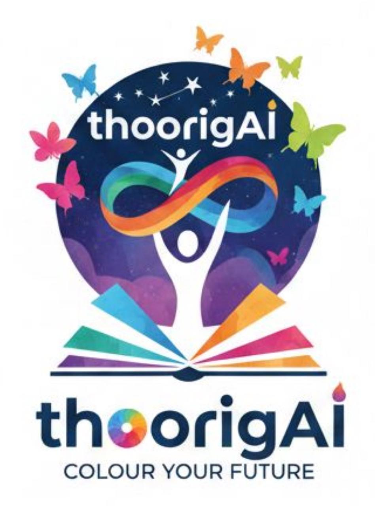

  

# 🎓 Thoorigai Infotech

> **Bridging the tech gap in tier-2 cities — hands-on software education for students in Thoothukudi and beyond.**

We are a software training academy based in **Tuticorin (Thoothukudi), Tamil Nadu**, committed to equipping students from tier-2 and tier-3 cities with industry-relevant technology skills.

---

## 🏫 About Us

**Thoorigai Infotech LLP** is a technology training consortium of seasoned IT industry professionals committed to empowering aspiring learners with practical skills for successful careers in the IT industry.

Our mission is to bridge the gap between academic learning and real-world industry requirements. Through hands-on training, project-based learning, and expert mentorship, we help students develop strong foundations in programming, software development, and emerging technologies.

At Thoorigai Infotech, we believe that the right guidance and practical exposure can transform potential into professional capability. Our programs are designed to equip students with the technical knowledge, problem-solving ability, and confidence required to thrive in today's rapidly evolving technology landscape.

Whether you are a student exploring your first steps in programming or a learner looking to build a career in software development, Thoorigai Infotech provides a structured pathway to grow, learn, and succeed in the digital world.

> 💡 *Learn. Build. Launch your IT career.*

- 📍 [Tuticorin (Thoothukudi), Tamil Nadu, India](https://maps.app.goo.gl/CezrvfU3JPdnBVqY7)
- 🎯 Focused on students from South Tamil Nadu and rural communities
- 💡 Hands-on, project-based learning approach
- 🤝 Mentorship-driven training environment

---

## 📚 Courses We Offer

| Course | Level |
|---|---|
| 🐍 Python Programming | Beginner → Advanced |
| 🌐 Web Development (HTML, CSS, JavaScript) | Beginner → Intermediate |
| ☕ Java Programming | Beginner → Advanced |
| 🗄️ SQL & Databases | Beginner → Intermediate |
| 📊 Data Science | Intermediate → Advanced |
| 🤖 Artificial Intelligence | Intermediate → Advanced |
| 📈 Data & Analytics | Intermediate → Advanced |

---

## 🛠️ Technologies We Train

---

## 📂 What You'll Find Here

This GitHub organisation hosts:
- 📁 **Course starter code** and project templates for students
- 🧪 **Hands-on exercises** and lab assignments
- 🏗️ **Capstone project** examples and references
- 📖 **Learning resources** and reference guides

---

## 📬 Get In Touch

Interested in enrolling or partnering with us?

- 🌐 Website: [thoorigaiinfotech.com](https://thoorigaiinfotech.com)
- 📧 Email: thoorigai.infotech.llp@gmail.com
- 📞 Phone: +91 93841 34008 / +91 93841 64008
- 📍 Location: [Tuticorin (Thoothukudi), Tamil Nadu, India](https://maps.app.goo.gl/CezrvfU3JPdnBVqY7)

---

  <em>Rooted in Thoothukudi. Training Tamil Nadu's next generation of software professionals.</em>

